# Database Schema — ER Diagram

Generated from [`apps/web/lib/models.ts`](../apps/web/lib/models.ts). Renders automatically on GitHub. In VS Code, install the free "Markdown Preview Mermaid Support" extension and open the preview (`Ctrl+Shift+V`); or paste the diagram block into [mermaid.live](https://mermaid.live) to view and export PNG/SVG.

For the full field-by-field export (every column, defaults, unique indexes), see [`db-schema.dbml`](db-schema.dbml) — paste it into [dbdiagram.io](https://dbdiagram.io) for an interactive, draggable diagram.

Notes:

- **2026-07 restructure:** surveys were removed entirely; the old `sessionType` field is gone. `Session` now models only the standard 2-phase live webapp session. Single Ja/Nej questions (mobile Hem/Rösta) and municipal agenda items both live in the `Question` family; a municipal question carries a `meetingId` ref. `scripts/restructure-db.js` migrates existing data.
- **No denormalized aggregates on proposals/comments/citizen proposals/municipal items:** rating averages/counts are computed at read time from the rating collections (`ProposalRating`, `CommentRating`, `QuestionCommentRating`, `CitizenProposalRating`, `MunicipalItemRating`) — the old stored `averageRating`/`thumbsUpCount`/`totalStars`/`ratingCount` fields drifted out of sync. Author display names are joined from `User` via `userId`/`authorId`, not stored as snapshots. Session deadlines are per-session (`Session.deadline`), replacing the old global `Settings.sessionLimitHours`. `QuestionVote.choice` is `ja`/`nej` only (the unused `abstar` option was removed). The unused `CitizenProposal` fields `selectedForMunicipalSession`/`selectedAt`/`submittedAsMotionAt`/`motionNumber` were dropped outright.
- MongoDB has no foreign keys — the relationships below reflect Mongoose `ref:` fields.
- The budget collections (`BudgetVote`, `BudgetResult`, `BudgetArgument`, `BudgetCategoryRating`) link via the **string** field `BudgetSession.sessionId`, not the Mongo `_id`.
- `MunicipalMeeting.items[]` and `BudgetSession.categories[]`/`incomeCategories[]` are embedded subdocument arrays, not separate collections. `MunicipalItemRating.itemId` points at an embedded item's `_id`.
- Standalone collections not shown: `LoginCode` (OTP codes, TTL 10 min), `Settings` (global app settings).

```mermaid
erDiagram
    %% ── Standard live sessions ──
    User ||--o{ Session : "createdBy"
    Session ||--o{ Proposal : "has"
    User ||--o{ Proposal : "authors"
    Proposal ||--o{ ProposalRating : "rated by (1-5, unique per user)"
    Proposal ||--o{ Comment : "debated in"
    Comment ||--o{ CommentRating : "rated by (1-5, unique per user)"
    Proposal ||--o{ FinalVote : "yes/no (unique per user)"
    Session ||--o{ WinningProposal : "winners archived as"
    Proposal ||--o| WinningProposal : "archived as"
    User ||--o{ ProposalRating : "casts"
    User ||--o{ CommentRating : "casts"
    User ||--o{ FinalVote : "casts"
    User ||--o{ SessionRequest : "requests quota"

    %% ── Questions (Ja/Nej + discussion) ──
    User ||--o{ Question : "createdBy"
    Question ||--o{ QuestionVote : "ja/nej/avstår (unique per user)"
    Question ||--o{ QuestionComment : "för/emot discussion"
    QuestionComment ||--o{ QuestionCommentRating : "rated by (1-5, unique per user)"
    User ||--o{ QuestionVote : "casts"
    User ||--o{ QuestionComment : "writes"
    User ||--o{ QuestionCommentRating : "casts"

    %% ── Municipal ──
    User ||--o{ MunicipalMeeting : "createdBy"
    MunicipalMeeting ||--o{ MunicipalItem : "items[] (embedded)"
    MunicipalItem |o--o| Question : "spawns on activation"
    MunicipalItem ||--o{ MunicipalItemRating : "rated by (1-5, unique per user)"
    User ||--o{ MunicipalItemRating : "casts"

    %% ── Citizen proposals ──
    User ||--o{ CitizenProposal : "authors (max 1 pre-election)"
    CitizenProposal ||--o{ CitizenProposalRating : "rated by (1-5, unique per user)"
    User ||--o{ CitizenProposalRating : "casts"

    %% ── Budget (string sessionId links) ──
    User ||--o{ BudgetSession : "createdBy"
    BudgetSession ||--o{ BudgetCategory : "categories[] (embedded)"
    BudgetSession ||--o{ BudgetIncomeCategory : "incomeCategories[] (embedded)"
    BudgetSession ||--o{ BudgetVote : "one per user"
    BudgetSession ||--o| BudgetResult : "computed median"
    BudgetSession ||--o{ BudgetArgument : "up/down debate"
    BudgetSession ||--o{ BudgetCategoryRating : "1-5 per category per user"
    User ||--o{ BudgetVote : "casts"
    User ||--o{ BudgetArgument : "writes"
    User ||--o{ BudgetCategoryRating : "casts"

    User {
        objectid _id PK
        string email UK
        bool isAdmin
        bool isSuperAdmin
        string adminStatus "none|pending|approved|denied"
        string notificationPreference "email|sms|both|none"
        string expoPushToken
        string phoneNumber
        string[] interests
    }

    Session {
        objectid _id PK
        string title
        string status "active|closed"
        string phase "phase1|phase2|closed"
        date deadline "set at creation; daily cron closes"
        objectid createdBy FK
        string imageUrl
        string[] categories
    }

    Proposal {
        objectid _id PK
        objectid sessionId FK
        objectid authorId FK
        string title
        string status "active|finalist|archived"
        string imageUrl
    }

    ProposalRating {
        objectid _id PK
        objectid proposalId FK
        objectid userId FK
        int rating "1-5"
    }

    Comment {
        objectid _id PK
        objectid proposalId FK
        objectid userId FK
        string type "for|against|neutral"
    }

    CommentRating {
        objectid _id PK
        objectid commentId FK
        objectid userId FK
        int rating "1-5"
    }

    FinalVote {
        objectid _id PK
        objectid proposalId FK
        objectid userId FK
        string choice "yes|no"
    }

    WinningProposal {
        objectid _id PK
        objectid sessionId FK
        objectid proposalId FK
        int yesVotes
        int noVotes
    }

    SessionRequest {
        objectid _id PK
        objectid userId FK
        int requestedSessions
        string status "pending|approved|denied"
    }

    Question {
        objectid _id PK
        string text "the Ja/Nej question"
        string status "active|closed"
        date deadline "required; daily cron closes"
        string imageUrl
        string[] categories
        objectid createdBy FK
        objectid meetingId FK "set for municipal items"
        date closedAt
    }

    QuestionVote {
        objectid _id PK
        objectid questionId FK
        objectid userId FK
        string choice "ja|nej"
    }

    QuestionComment {
        objectid _id PK
        objectid questionId FK
        objectid userId FK
        string type "for|against|neutral"
    }

    QuestionCommentRating {
        objectid _id PK
        objectid commentId FK
        objectid userId FK
        int rating "1-5"
    }

    MunicipalMeeting {
        objectid _id PK
        string municipality
        date meetingDate
        string meetingType
        string status "draft|active|closed|archived"
        objectid createdBy FK
    }

    MunicipalItem {
        objectid _id PK "embedded in items[]"
        string title
        string[] categories
        string imageUrl
        objectid questionId FK
        string status "draft|active|closed"
    }

    MunicipalItemRating {
        objectid _id PK
        objectid meetingId FK
        objectid itemId FK "embedded item _id"
        objectid userId FK
        int rating "1-5"
    }

    CitizenProposal {
        objectid _id PK
        objectid authorId FK
        string title
        string status "active|selected|submitted_as_motion|rejected|archived"
        string imageUrl
    }

    CitizenProposalRating {
        objectid _id PK
        objectid proposalId FK
        objectid userId FK
        int rating "1-5"
    }

    BudgetSession {
        objectid _id PK
        string sessionId UK "string key used by budget refs"
        string municipality
        float totalBudget
        string status "draft|active|closed"
        objectid createdBy FK
    }

    BudgetCategory {
        string id PK "embedded in categories[]"
        string name
        float defaultAmount
        string[] tags
        string imageUrl
        float averageRating
    }

    BudgetIncomeCategory {
        string id PK "embedded in incomeCategories[]"
        string name
        float amount
        bool isTaxRate
    }

    BudgetVote {
        objectid _id PK
        string sessionId FK "BudgetSession.sessionId"
        objectid userId FK
        float totalExpenses
        float totalIncome
    }

    BudgetResult {
        objectid _id PK
        string sessionId UK "one per BudgetSession"
        float totalMedianExpenses
        float balancedExpenses
        int voterCount
    }

    BudgetArgument {
        objectid _id PK
        string sessionId FK "BudgetSession.sessionId"
        objectid userId FK
        string categoryId
        string direction "up|down"
    }

    BudgetCategoryRating {
        objectid _id PK
        string sessionId FK "BudgetSession.sessionId"
        string categoryId
        objectid userId FK
        int rating "1-5"
    }
```

